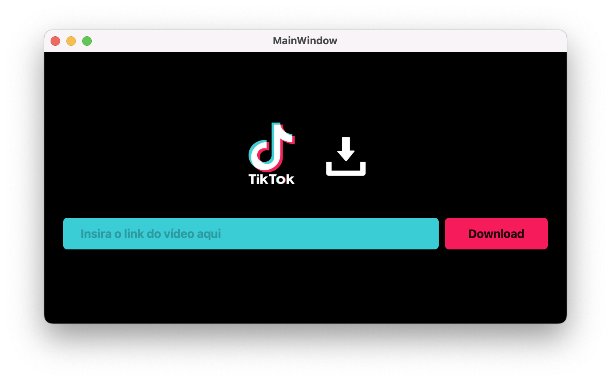

# Tiktok Downloader PySide6 or PyQt6

<h4 align="center">
  ☕ Code and coffee
</h4>

## Tecnologias

Esse projeto foi desenvolvido com as seguintes tecnologias:

- [Python](https://python.org/)
- [PySide6](https://www.qt.io/qt-for-python)

## Screenshots

APP
<h1 align="center">
    
</h1>

## Configuração do ambiente de desenvolvimento
Para configurar o ambiente de desenvolvimento, por favor siga os passos abaixo.

1. Instale Python3, Pip3 e o Pipenv.
    * `sudo pip3 install pipenv`
2. Clone este repositório.
    * `git clone https://github.com/`
3. Dentro do diretório do repositório, execute os seguintes comandos.
    * `pipenv install`
    * `pipenv shell`

